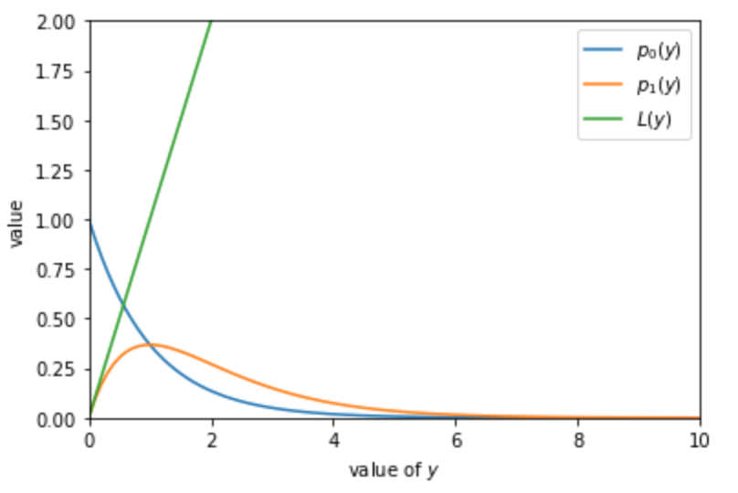
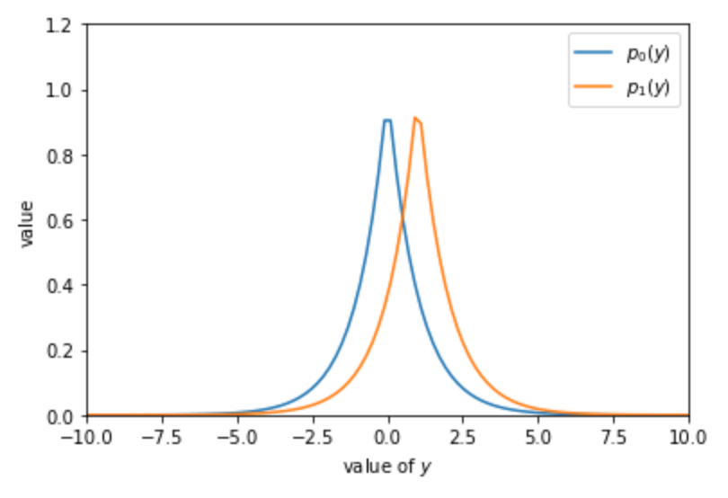
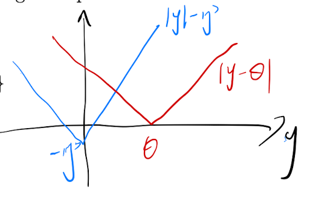
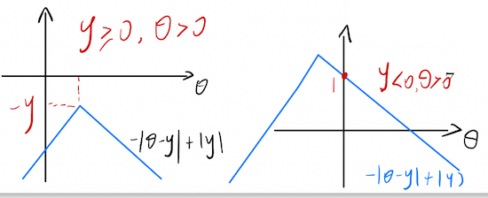
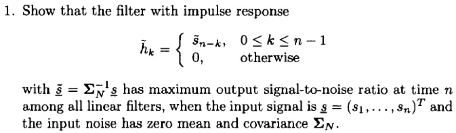
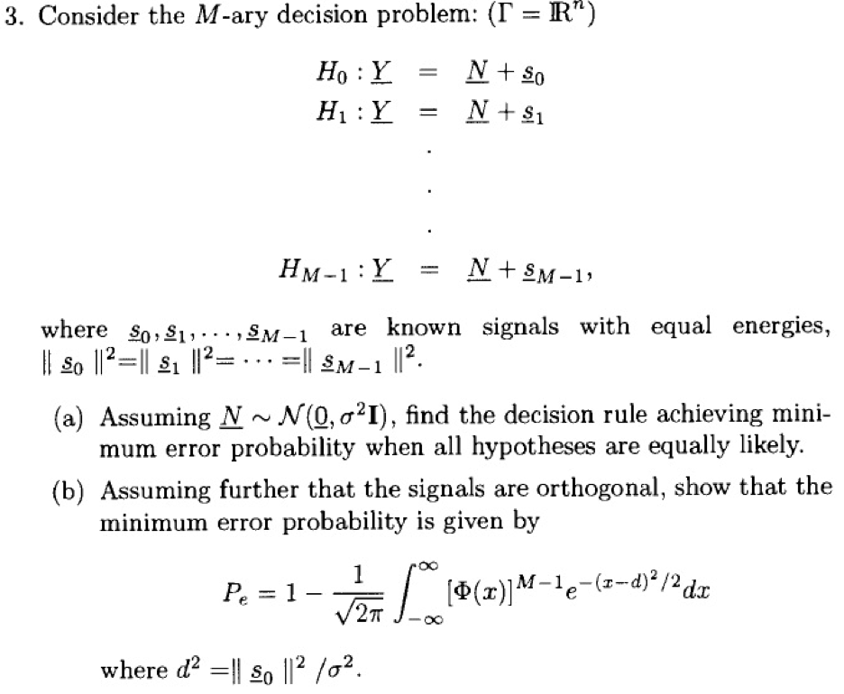
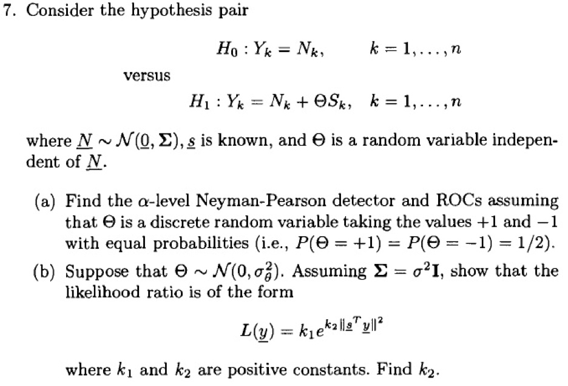
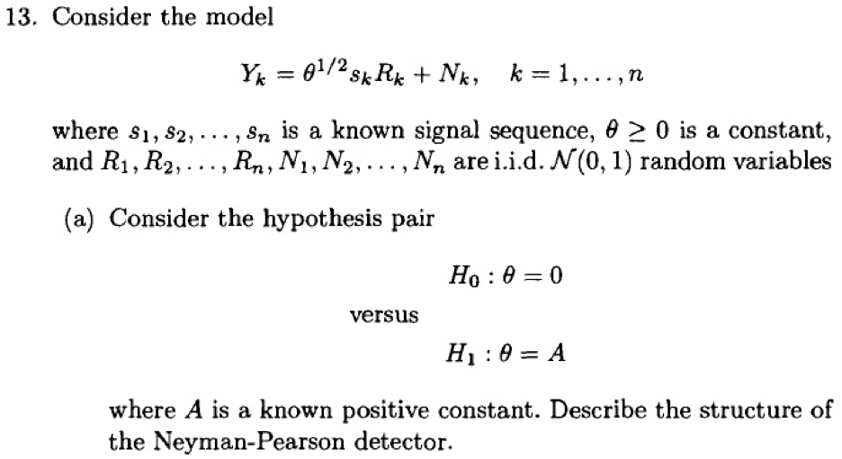
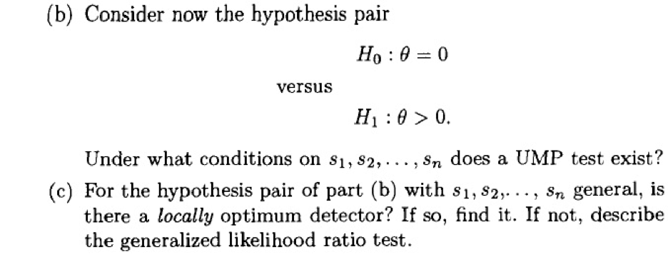
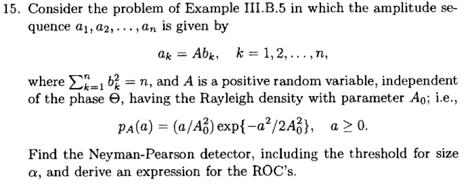

# An Introduction to signal Detection and Estimation
 BUPT homework

## HW-1

### 1st problem


#### solution (a):

Firstly, according to $(II.B.10)$​, write the likelihood ratio as:
$$
\begin{aligned}
L(y)&=\frac{p_1(y)}{p_0(y)}\\
&=\begin{cases}
\frac{3}{2(y+1)}, & 0\leq y \leq 1\\
meaninglesss, & \text{otherwise}
\end{cases}
\end{aligned}
$$


according to $(II.B.12)$​ The bayes rule can be writen as:
$$
\delta_{B}(y)= \begin{cases}1 & \text { if } L(y) \geq \tau \\ 0 & \text { if } L(y)<\tau\end{cases}
$$
where $\tau = 1$​ under the uniform costs and equal priors,

The plot of $L(y)$​ and $\tau$ is drawing as :


 Thus the bayes rule is rewritten to the form as:
$$
\begin{aligned}
\delta_{B}(y)&= \begin{cases}1, \text { if }\frac{3}{2(y+1)} \geq 1 \\ 0 & \text { if } \frac{3}{2(y+1)}<1\end{cases}\\
&=\begin{cases}1 & \text { if } y \leq 0.5 \\ 0 & \text { if } y>0.5\end{cases}
\end{aligned}
$$

The bayes risk is given by $(II.B.14)$​, and  because the uniform costs and equal priors, the Bayes risk can be written as:
$$
\begin{aligned}
r(\delta_B)&=\pi_{0} P_{0}\left(\Gamma_{1}\right)+\pi_{1} P_{1}\left(\Gamma_{0}\right)\\
&=0.5\int_{0}^{0.5}p_0(y)+0.5\int_{0.5}^{1}p_1(y)
\end{aligned}
$$
Where $p(y)= 0.5\cdot(p_1(y)+p_0(y))=\frac{2y+5}{6}$​​ , the risk is rewritten as:

$$
\begin{aligned}
r(\delta_B)
= 0.5\cdot \left[\int_0^{0.5}2/3\cdot (y+1)+\int_{0.5}^{1}1 \right]
\end{aligned}
$$
```matlab
fun1 = @(y) (2/3)./(y+1);
q1 = integral(fun1, 0, 0.5)

fun2 = @(y) y.^0
q2 = integral(fun2, 0.5, 1)

fanal = 0.5*(q1+q2)
```
var the matlab code shown above, the Bayes risk is calculated as:
$$
r(\delta_B) = 0.3852
$$

#### Solution(b):

The function $ V$ Is given by :
$$
V(\pi_0) = 
\begin{cases}
\pi_0, &0 \leq \pi_0 < 3/7
\\
\pi_0\left(\int_0^{\tau^{'}} \frac{2}{3}(y+1)\cdot dy\right)+(1-\pi_0)\left(\int_{\tau^{'}}^11\cdot dy \right), &3/7 \leq \pi_0 < 3/5\\
1-\pi_0, & 3/5 \leq \pi_0 < 1
\end{cases}
$$
Where $\tau^{'}= \frac{3-5\pi_0}{2\pi_0}$ Is the threotle. Since $V(0) = 0, V(1) = 0$​, the least favorable prior $\pi_L$

 is in the interior $(0, 1)$ in this case. And it is unnecessary to consider teh case that $P_{0}(L(Y)=\tau)=P_{1}(L(Y)=\tau)=0$ since $L(Y)$​ is a continuous random variable. So an equalizer rule is found by solving:
$$
\int_0^{\tau^{'}} \frac{2}{3}(y+1)\cdot dy=\int_{\tau^{'}}^11\cdot dy 
$$
Then, $\tau_L^{'}= \frac{-5+\sqrt{37}}{2}$​​​​​, so $\pi^{'}_L = \frac{3}{2\tau_0+5}=\frac{3}{\sqrt{37}}$​​​​, so the minimax rule is:
$$
\delta_{\pi_L}(y)&= \begin{cases}1, &\text { if }y  \leq \frac{3}{\sqrt{37}} \\ 0, & \text { if } y > \frac{3}{\sqrt{37}}\end{cases}
$$
Then the minimax risk for the uniform costs is:
$$
r_u(\delta_{\pi})=0.5\cdot \int_{0}^{\frac{3}{\sqrt{37}}}2/3\cdot (y+1)+0.5\cdot \int_{\frac{3}{\sqrt{37}}}^{1}1\cdot dy=0.4099
$$

```matlab
fun1 = @(y) 1/3.*(y+1);
q1 = integral(fun1, 0, 3/sqrt(37))

fun2 = @(y) 0.5*y.^0;
q2 = integral(fun2, 3/sqrt(37), 1)

fanal = q1+q1
```


#### Solution (c):

First, write the false-alarm probability as:
$$
\begin{aligned}
P_0(p_1(Y)>\eta \cdot p_0(Y))&=P_0(L(Y)>\eta)\\
&=P_0(Y<\eta^{'})\\
&=\frac{1}{3}{\eta^{'}}^{2}+\frac{2}{3}\eta^{'}
\end{aligned}
$$
Where $\eta^{'}=\frac{3-2\eta}{2\eta}$ and get the $\eta_0^{'}$ by sovling $P_0(p_1(Y)>\eta \cdot p_0(Y))=\alpha$:
$$
\eta_0^{'} = \sqrt{1+3\alpha}-1
$$
Then the Neyman-Pearson rule is given by:
$$
\tilde{\delta}_{N P}(y)= \begin{cases}1 & \text { if } y \geq \eta_{0}^{\prime} \\ 0 & \text { if } y<\eta_{0}^{\prime}\end{cases}
$$
Where $\eta_0^{'} = \sqrt{1+3\alpha}-1$​.


### 2rd problem


#### solution:

Firstly, written the likelihood ratio as:
$$
\begin{aligned}
L(y) &= \frac{p_1(y)}{p_0(y)}, \quad y\geq 0\\
&=\sqrt{2 / \pi} e^{-y^{2} / 2 +y}
\end{aligned}
$$
Then the Threshold $\tau = \frac{\pi_0}{\pi_1}$, so the $\Gamma_1 $ Can be found by:
$$
\begin{aligned}
&L(y)\geq \tau\\
\Rightarrow & \sqrt{2 / \pi} e^{-y^{2} / 2 +y}\geq\frac{\pi_0}{(1-\pi_0)}\\
\Rightarrow & y^2 -2y+2\cdot ln\left( \sqrt{\frac{\pi}{2} }\cdot \frac{\pi_0}{1-\pi_0} \right) \leq 0
\end{aligned}
$$

Then the final bayes rule under $\forall \pi_0 \in [0,1]$ can be obtained as follows:
$$
\delta_B(y)=\begin{cases} 
 1,\quad & y \in [1-\sqrt{1-c}, 1+\sqrt{1-c}] \\
 0, \quad & y \in [0, 1-\sqrt{1-c}) \cup(1-\sqrt{1-c}, +\infin)
\end{cases}
\quad
when\quad \pi_0 \in [0, \frac{1}{\sqrt{\frac{\pi}{2e}}+1} )
$$

Where $c = 2\cdot ln(\sqrt{\frac{\pi}{2}}\cdot\frac{\pi_0}{1-\pi_0})$
$$
\delta_B(y)=0
\quad
when\quad \pi_0 \in [\frac{1}{\sqrt{\frac{\pi}{2e}}+1},  +\infin)
$$


### 3rd problem


#### solution （a）：

write the $pdf$ of $H_0$ and $H_1$:
$$
\begin{aligned}
p_0(y) = p(y) = e^{-y}, \quad y\in(0,+\infin)
\end{aligned}
$$
And for $H_1$
$$
p_1(y) = \int_{-\infty}^{\infty} p(y-s) p(y) d s=\int_{0}^{y} e^{s-y} e^{-s} d s=y e^{-y}, \quad y\in (0, +\infin)
$$
Thus, the likelihood ratio is:
$$
L(y)=\frac{p_{1}(y)}{p_{0}(y)}=y, \quad y>0
$$
The plot of the pdf and the likelihood ratio is :



#### Solution (b):

First, write the false-alarm probability as:
$$
\begin{aligned}
P_0(p_1(Y)>\eta \cdot p_0(Y))&=P_0(L(Y)>\eta)\\
&=P_0(Y>\eta)\\
&=\int_0^{\eta}e^{-y}\cdot dy=e^{-\eta}
\end{aligned}
$$
Then the threshold $\eta$ Can be obtained by:
$$
P_F(\delta_{NP})&=e^{-\eta}=\alpha \\
\Longrightarrow &\eta = -ln(\alpha)
$$
So the detection probability is :
$$
P_{D}\left(\delta_{N P}\right)=P_{1}(Y>\eta)=\int_{\eta}^{\infty} y e^{-y} d y=(\eta+1) e^{-\eta}=\alpha(1-\ln \alpha), \quad 0<\alpha<1
$$

#### Solution (c):

Similar as (a), first write the pdf:
$$
p_{0}(y)=\prod_{k=1}^{n} p\left(y_{k}\right)=\prod_{k=1}^{n} e^{-y_{k}}, \quad 0<\min \left\{y_{1}, y_{2}, \ldots, y_{n}\right\}
$$
And for $H_1$:
$$
\begin{aligned}
p_{1}(y) &=\int_{-\infty}^{\infty}\left[\prod_{k=1}^{n} p\left(y_{k}-s\right)\right] p(s) d s=\int_{0}^{\min \left\{y_{1}, y_{2}, \ldots, y_{n}\right\}}\left[\prod_{k=1}^{n} e^{s-y_{k}}\right] e^{-s} d s \\
=& \frac{p_{0}(y)}{n-1}\left[e^{(n-1) \min \left\{y_{1}, y_{2}, \ldots, y_{n}\right\}}-1\right], \quad 0<\min \left\{y_{1}, y_{2}, \ldots, y_{n}\right\}
\end{aligned}
$$
Thus, the likelihood ratio can be written as:
$$
L(y)=\frac{1}{n-1}\left[e^{(n-1) \min \left\{y_{1}, y_{2}, \ldots, y_{n}\right\}}-1\right], \quad 0<\min \left\{y_{1}, y_{2}, \ldots, y_{n}\right\}
$$

#### Solution (d):

Firstly, write the false alarm probability as:
$$
\begin{aligned}
P_{F}\left(\delta_{N P}\right)=& P_{0}(L(Y)>\eta)=P_{0}\left(\min \left\{Y_{1}, Y_{2}, \ldots, Y_{n}\right\}>\eta^{\prime} \equiv \frac{\log ((n-1) \eta+1)}{n-1}\right) \\
&=P_{0}\left(\bigcap_{k=1}^{n}\left(Y_{k}>\eta^{\prime}\right)\right)=\prod_{k=1}^{n} P_{0}\left(Y_{k}>\eta^{\prime}\right)=\prod_{k=1}^{n} e^{-\eta^{\prime}}=e^{-n \eta^{\prime}}
\end{aligned}
$$
Where the $\eta^{\prime}=-\frac{1}{n} \log \alpha$, and the threshold $\eta$ is:
$$
\eta=\frac{e^{(n-1) \eta^{\prime}}-1}{n-1}=\frac{\alpha^{-(n-1) / n}-1}{n-1}
$$


### 4th problem


The pdf under $H_0,\ H_1$



#### Solution (a):

According to $\text { (II.E.31) }$ , the $\alpha$-level $locally\ most\ powerful$ (LMP) test is :
$$
\tilde{\delta}_{l o}(y)= \begin{cases}1 & \text { if }\left.\frac{\partial p_{\theta}(y)}{\partial \theta}\right|_{\theta=0}>\eta p_{0}(y) \\ \gamma, & \text { if }\left.\frac{\partial p_{\theta}(y)}{\partial \theta}\right|_{\theta=0}=\eta p_{0}(y) \\ 0 & \text { if }\left.\frac{\partial p_{\theta}(y)}{\partial \theta}\right|_{\theta=0}<\eta p_{0}(y)\end{cases}
$$
And :
$$
\begin{aligned}
&\left.\frac{\partial p_{\theta}(y)}{\partial \theta}\right|_{\theta=0}=\begin{cases}
\frac{1}{2} e^{-y},\quad& y>0 \\
-\frac{1}{2}e^{-y},\quad& y<0
\end{cases}\\

\Longrightarrow & \frac{\left.\frac{\partial p_{\theta}(y)}{\partial \theta}\right|_{\theta=0}}{p_0(y)}=\begin{cases}1, \quad & y>0\\
0, \quad & y<0
\end{cases}=sgn(y)
\end{aligned}
$$
Thus, 
$$
\tilde{\delta}_{l o}(y)= \begin{cases}1 & \text { if } \operatorname{sgn}(y)>\eta \\ \gamma, & \text { if } \operatorname{sgn}(y)=\eta \\ 0 & \text { if } \operatorname{sgn}(y)<\eta\end{cases}
$$
Since $\alpha = E_0[\tilde{\delta}_{l o}(y)]$ The randomization $\gamma$ is :
$$
\gamma=\frac{\alpha-P_{0}(\operatorname{sgn}(Y)>\eta)}{P_{0}(\operatorname{sgn}(Y)=\eta)}
$$
this implies the range of $\eta$, i.e., $\eta \in \{-1, 1\}$ , notice that $\gamma > 0$, and $P_{0}(\operatorname{sgn}(Y)>\eta)=\begin{cases}0, \ &\eta=1 \\1/2, \ &\eta=-1 \end{cases}$and $P_{0}(\operatorname{sgn}(Y)=\eta)=1/2, \forall \eta \in \{-1, 1 \}$, so the randomization is :
$$
\gamma= \begin{cases}2 \alpha & \text { if } 0<\alpha<1 / 2 \\ 2 \alpha-1 & \text { if } 1 / 2 \leq \alpha<1\end{cases}
$$
The LMP rules is:
$$
\delta_{l o}(y)= \begin{cases}2 \alpha & \text { if } y>0 \\ 0 & \text { if } y \leq 0\end{cases}, \quad \text{for}\ 0<\alpha<1 / 2
$$

$$
\delta_{l o}(y)= \begin{cases}1 & \text { if } y \geq 0 \\ 2 \alpha-1 & \text { if } y<0\end{cases}\quad \text{for}\ 1/2\leq\alpha<1 
$$

The power function is the detection probability :
$$
P_{D}\left(\tilde{\delta}_{l o} ; \theta\right)=P_{\theta}(\operatorname{sgn}(Y)>\eta)+\gamma P_{\theta}(\operatorname{sgn}(Y)=\eta)\\
\begin{gathered}
= \begin{cases}2 \alpha \int_{0}^{\infty} \frac{1}{2} e^{-|y-\theta|} d y & \text { if } 0<\alpha<1 / 2 \\
\int_{0}^{\infty} \frac{1}{2} e^{-|y-\theta|} d y+(2 \alpha-1) \int_{-\infty}^{0} \frac{1}{2} e^{-|y-\theta|} d y & \text { if } 1 / 2 \leq \alpha<1\end{cases} \\
= \begin{cases}\alpha\left(2-e^{-\theta}\right) & \text { if } 0<\alpha<1 / 2 \\
1+(\alpha-1) e^{-\theta} & \text { if } 1 / 2 \leq \alpha<1\end{cases}
\end{gathered}
$$

#### Solution (b):

$\text { the NP critical region is }$
$$
\Gamma_{\theta}=\left\{\frac{p_{\theta}(y)}{p_0(y)}>\eta\right\}=\left\{|y|-|y-\theta|>\eta^{\prime}\right\}
$$


According to the figure shown above, the NP critical region is:
$$
\Gamma_{\theta}=\begin{cases}(-\infty, \infty) & \text { if } \eta^{\prime}<-\theta \\ \left(\left(\frac{\eta^{\prime}+\theta}{2}\right), \infty\right) & \text { if }-\theta \leq \eta^{\prime} \leq \theta \\ \phi & \text { if } \eta^{\prime}>\theta\end{cases}
$$
Obviously, the critical region is relevant to the parameter $\theta$, so the UMP test doesn't exist.

The generalized likelihood ratio test uses this statistic:




$$
\begin{aligned}
&\sup _{\theta>0} e^{|y|-|y-\theta|}=\exp \left\{\sup _{\theta>0}(|y|-|y-\theta|)\right\} \\
&= \begin{cases}1 & \text { if } y<0 \\
e^{y} & \text { if } y \geq 0\end{cases}
\end{aligned}
$$


### 5th problem


Similar as $(\text { II.B.6) }$, the overall cost function can be written as:
$$
\begin{gathered}
r(\delta)=\sum_{j=0}^{M-1} \sum_{i=0}^{M-1} \pi_{j} C_{i j} P_{j}\left(\Gamma_{i}\right)=\sum_{i=0}^{M-1}\left[\sum_{j=0}^{M-1} \pi_{j} C_{i j} P_{j}\left(\Gamma_{i}\right)\right] \\
=\sum_{i=0}^{M-1}\left[\sum_{j=0}^{M-1} \pi_{j} C_{i j} \int_{\Gamma_{i}} p_{j}(y) \mu(d y)\right]=\sum_{i=0}^{M-1} \int_{\Gamma_{i}}\left[\sum_{j=0}^{M-1} \pi_{j} C_{i j} p_{j}(y)\right] \mu(d y)
\end{gathered}
$$
in order to minimize the cost $r(\delta)$, each region $\Gamma_i$ should enpower the $\left[\sum_{j=0}^{M-1} \pi_{j} C_{i j} p_{j}(y)\right]$ to be the smallest for $i \in \text{Indexs of all hypothesis}$ then the bayes rule decision regions are defined as:
$$
\Gamma_{i}=\left\{y \in \Gamma \mid \sum_{j=0}^{M-1} \pi_{j} C_{i j} p_{j}(y)=\min _{0 \leq k \leq M-1} \sum_{j=0}^{M-1} \pi_{j} C_{k j} p_{j}(y)\right\}
$$


### 6th problem


#### solution (a):

the pdf for $H_0, \ H_1$ are:
$$
p_1(y)  =\prod_{k=1}^{n} \frac{1}{\sqrt{2 \pi} \sigma_{0}} e^{-\left(y_{k}-\mu_{0}\right)^{2} / 2 \sigma_{0}^{2}}
$$
and
$$
p_0(y)=\prod_{k=1}^{n} \frac{1}{\sqrt{2 \pi} \sigma_{1}} e^{-\left(y_{k}-\mu_{1}\right)^{2} / 2 \sigma_{1}^{2}}
$$
So the likehood ratio is:
$$
\begin{gathered}
L(y)=\frac{\prod_{k=1}^{n} \frac{1}{\sqrt{2 \pi} \sigma_{1}} e^{-\left(y_{k}-\mu_{1}\right)^{2} / 2 \sigma_{1}^{2}}}{\prod_{k=1}^{n} \frac{1}{\sqrt{2 \pi} \sigma_{0}} e^{-\left(y_{k}-\mu_{0}\right)^{2} / 2 \sigma_{0}^{2}}} \\
=\left(\frac{\sigma_{0}}{\sigma_{1}}\right)^{n} e^{\frac{n}{2}\left(\frac{\mu_{0}^{2}}{\sigma_{0}^{2}}-\frac{\mu_{1}^{2}}{\sigma_{1}^{2}}\right)} e^{\left(\frac{1}{2 \sigma_{0}^{2}}-\frac{1}{2 \sigma_{1}^{2}}\right) \sum_{k=1}^{n} y_{k}^{2}} e^{\left(\frac{\mu_{1}}{\sigma_{1}^{2}}-\frac{\mu_{0}}{\sigma_{0}^{2}}\right) \sum_{k=1}^{n} y_{k}}
\end{gathered}
$$

#### Solution (b):

1) if $\left.(\mu_0=\mu_{1}, \sigma_{1}^{2}>\sigma_{0}^{2}\right)$

in this case, the likehood ratio become:
$$
L(y)=\left(\frac{\sigma_0}{\sigma_1}\right)^ne^{\left( \frac{1}{2\sigma_0^2}- \frac{1}{2\sigma_1^2} \right)\cdot \sum_{k=1}^n(y_k-\mu)^2}
$$
So the Neyman-Pearson test operates by comparing $\sum_{k=1}^n(y_k-\mu)^2$  to a threshold

2) if $\left(\sigma_{0}^{2}=\sigma_{1}^{2}, \mu_{1}>\mu_{0}\right)$

in this case, the likehood ratio become:
$$
L(y) = exp\left(2(\mu_1-\mu_0 )\cdot\sum_{k= 1}^{n}y_k+n\cdot(\mu_0-\mu_1) \right)
$$
So the Neyman-Pearson test operates by comparing $\sum_{k=1}^ny_k$  to a threshold

#### Solution (c):

in this case, the likehood ratio become:
$$
\begin{aligned}
L(y)&=\left(\frac{\sigma_0}{\sigma_1}\right)^ne^{\left( \frac{1}{2\sigma_0^2}- \frac{1}{2\sigma_1^2} \right)\cdot \sum_{k=1}^n(y_k-\mu)^2}\\
&=\frac{\sigma_0}{\sigma_1}\cdot e^{\left( \frac{1}{2\sigma_0^2}- \frac{1}{2\sigma_1^2} \right)\cdot (y_1-\mu)^2}
\end{aligned}
$$
The form of the NP test is:
$$
\delta_{N P}(y)= \begin{cases}1 & \text { if }\left(y_{1}-\mu\right)^{2} \geq \eta^{\prime} \\ 0 & \text { if }\left(y_{1}-\mu\right)^{2}<\eta^{\prime}\end{cases}
$$


write the false-alarm probability as:
$$
\begin{aligned}
P_0(p_1(Y)>\eta \cdot p_0(Y))&=P_0(L(Y)>\eta)\\
&=P_0((y_1-\mu)^2>\eta^{'})\\
&=2\left[1-\Phi\left(\frac{\sqrt{\eta^{\prime}}}{\sigma_{0}}\right)\right]
\end{aligned}
$$
since $P_0(p_1(Y)>\eta\cdotp_0(Y))=P_F(\delta_{NP})=\alpha$ , so for the $\alpha$ the threshold $\eta$ is set as :
$$
\eta^{\prime}=\left[\sigma_{0} \Phi^{-1}\left(1-\frac{\alpha}{2}\right)\right]^{2}
$$
and the detection probability is :
$$
\begin{aligned}
P_{D}\left(\delta_{N P}\right) 
&=P_1(\Gamma_1)=P_1\left(Y_1-\mu<-\sqrt{\eta^{\prime}}\ \cup Y_1-\mu>\sqrt{\eta^{\prime}}\right)\\

&=1-P_{1}\left(-\sqrt{\eta^{\prime}} \leq Y_{1}-\mu \leq \sqrt{\eta^{\prime}}\right)=2\left[1-\Phi\left(\frac{\sqrt{\eta^{\prime}}}{\sigma_{1}}\right)\right] \\
&=2\left[1-\Phi\left(\frac{\sigma_{0}}{\sigma_{1}} \Phi^{-1}\left(1-\frac{\alpha}{2}\right)\right)\right], \quad 0<\alpha<1
\end{aligned}
$$

## HW-2

### 1 




let ${\underline{h}}_{n}=[h_{n,1}, \dots, h_{n,l},\dots ,h_{n,n}]^{T}$ be the vector of the impulse response of a general discrete-time linear filter at  time $n$ .

The $SNR$ is :
$$
S N R=\frac{\left|\sum_{l=1}^{n} h_{n, l} s_{l}\right|^{2}}{E\left\{\left(\sum_{l=1}^{n} h_{n, l} N_{l}\right)^{2} \right\}} =\frac{\left|\underline{h}_{n}^{T} \underline{s}\right|^{2}}{\underline{h}_{n}^{T} \mathbf{\Sigma}_{N} \underline{h}_{n}}
$$
Since $\boldsymbol{\Sigma}_{N}=\boldsymbol{\Sigma}_{N}^{1 / 2} \boldsymbol{\Sigma}_{N}^{1 / 2}$, the $SNR$ can be further wirtten as:
$$
S N R=\frac{\left|\left(\boldsymbol{\Sigma}_{N}^{1 / 2} \underline{h}_{n}\right)^{T} \boldsymbol{\Sigma}_{N}^{-1 / 2} \underline{s}\right|^{2}}{\left\|\boldsymbol{\Sigma}_{N}^{1 / 2} \underline{h}_{n}\right\|^{2}}
$$
Then according to the Schwarz Inequality $\left|\underline{x}^{T} \underline{y}\right| \leq\|x\|\|y\|$, we have:
$$
S N R \leq\left\|\boldsymbol{\Sigma}_{N}^{1 / 2} \underline{s}\right\|^{2}
$$
And notice the  if and only if $\boldsymbol{\Sigma}_{N}^{1 / 2} \underline{h}_{n}=\lambda \boldsymbol{\Sigma}_{N}^{-1 / 2} \underline{s}$, the $S N R =\left\|\boldsymbol{\Sigma}_{N}^{1 / 2} \underline{s}\right\|^{2}$, so the max ratio is obtained if and only if $\underline{h}_{n}=\lambda \boldsymbol{\Sigma}_{N}^{-1} \underline{s}$, when $\lambda = 1$, $\underline{h}_{n}=\underline{\tilde{s}}$, then $\tilde{h}_{k}={\underline{h}}_{n,n-k}=\tilde{s}_{n-k}, \quad 0 \leq k \leq n-1$

### 2



#### (a)

Follow the conclusion of the 5-th problem in  HW-1, the critical regions are:
$$
\Gamma_{i}=\left\{y \in \Gamma \mid \sum_{j=0}^{M-1} \pi_{j} C_{i j} p_{j}(y)=\min _{0 \leq k \leq M-1} \sum_{j=0}^{M-1} \pi_{j} C_{k j} p_{j}(y)\right\}\\
\Gamma_{i}=\left\{y \in \Gamma \mid \sum_{j=0}^{M-1}p_j(y) - p_i(y)=\min _{0 \leq k \leq M-1} \left[ \sum_{j=0}^{M-1}p_j(y) - p_i(y)\right] \right\} \\
\Longrightarrow\Gamma_{i}=\left\{\underline{y} \in R^{n} \mid p_{i}(\underline{y})=\max _{0 \leq k \leq M-1} p_{k}(\underline{y})\right\}
$$
Since $p_k$ Follows distribution $N\left(\underline{s}_{k}, \sigma^{2} \mathbf{I}\right)$, this reduce to :
$$
\begin{gathered}
\Gamma_{i}=\left\{\underline{y} \in R^{n} \mid\left\|\underline{y}-\underline{s}_{i}\right\|^{2}=\min _{0 \leq k \leq M-1}\left\|y-s_{k}\right\|^{2}\right\} \\
=\left\{\underline{y} \in R^{n} \mid \underline{s}_{i}^{T} \underline{y}=\max _{0 \leq k \leq M-1} \underline{s}_{k}^{T} \underline{y}\right\}
\end{gathered}
$$

#### (b)

since all hypotheses are equally likely, the error probability is denoted by:
$$
P_{e}=\frac{1}{M} \sum_{k=0}^{M} P_{k}\left(\Gamma_{k}^{c}\right)
$$
Note that :
$$
\underline{y}=\max _{0 \leq k \leq M-1} \underline{s}_{k}^{T} \underline{y}\Leftrightarrow\max _{0 \leq l \neq k \leq M-1} \underline{s}_{l}^{T} \underline{Y}<\underline{s}_{k}^{T} \underline{Y}
$$
, Therefore:
$$
P_{k}\left(\Gamma_{k}^{c}\right)=1-P_{k}\left(\Gamma_{k}\right)=1-P_{k}\left(\max _{0 \leq l \neq k \leq M-1} \underline{s}_{l}^{T} \underline{Y}<\underline{s}_{k}^{T} \underline{Y}\right)
$$
Notice that $\underline{s}_{1}^{T} \underline{Y}, \underline{s}_{2}^{T} \underline{Y}, \cdots, \underline{s}_{n}^{T} \underline{Y}$ are i.i.d Gaussian random variable with the same variances $\sigma^{2}\left\|s_{1}\right\|^{2}$. Consider $z =\underline{s}_{k}^{T} \underline{Y}$, thus:
$$
\begin{gathered}
P_{k}\left(\max _{0 \leq l \neq k \leq M-1} \underline{s}_{l}^{T} \underline{Y}<\underline{s}_{k}^{T} \underline{Y}\right) \\
=\frac{1}{\sqrt{2 \pi} \sigma\left\|s_{1}\right\|} \int_{-\infty}^{\infty} P_{k}\left(\max _{0 \leq l \neq k \leq M-1} \underline{s}_{l}^{T} \underline{Y}<z\right) e^{-\left(z-\left\|s_{1}\right\|^{2}\right) / 2 \sigma^{2}\left\|s_{1}\right\|^{2}} d z
\end{gathered}
$$
Where:
$$
\begin{aligned}
P_{k}\left(\max _{0 \leq l \neq k \leq M-1} \underline{s}_{L}^{T}\right.&\underline{Y}<z)=P_{k}\left(\bigcap_{0 \leq l \neq k \leq M-1}\left\{s_{l}^{T} \underline{Y}<z\right\}\right) \\
=& \prod_{0 \leq l \neq k \leq M-1} P_{k}\left(\underline{s}_{l}^{T} \underline{Y}<z\right) \\
&=\left[\Phi\left(\frac{z}{\sigma\left\|s_{1}\right\|}\right)\right]^{M-1}
\end{aligned}
$$
setting $x=z / \sigma\left\|s_{1}\right\|$ and combining the above Eqs, the $P_e$ is denoted by:
$$
1-P_{k}\left(\Gamma_{k}\right)=\frac{1}{\sqrt{2 \pi}} \quad \int_{-\infty}^{\infty}[\Phi(x)]^{M-1} e^{-(x-d)^{\frac{2}{2}}} d x, k=0, \cdots, M-1
$$


### 3


First, notice that $\underline{I}$ is a linear transformation of $\underline{Y}$, and is Gaussian. We only need to prove that $E\{\underline{I}\}=\underline{0} \text { and } \operatorname{cov}(\underline{I})=\mathbf{I}$. We have:
$$
E\left\{I_{k}\right\}=\frac{E\left\{Y_{k}\right\}-E\left\{\hat{Y}_{k}\right\}}{\hat{\sigma}_{k}}
$$
$E\left\{\hat{Y}_{k}\right\}$ is an iterated expectation of $Y_{k}$; so $E\left\{Y_{k}\right\}=E\left\{\hat{Y}_{k}\right\}$And thus $E\left\{I_{k}\right\}=0, k=1, \cdots, n$. 

Next need to prove that $\operatorname{cov}(\underline{I})=\mathbf{I}$, :
$$
\operatorname{Var}\left(I_{k}\right)=E\left\{I_{k}^{2}\right\}=\frac{E\left\{\left(Y_{k}-\hat{Y}_{k}\right)^{2}\right\}}{\hat{\sigma}_{Y_{k}}^{2}}=\frac{\hat{\sigma}_{Y_{k}}^{2}}{\hat{\sigma}_{Y_{k}}^{2}}=1
$$
$\text { for } l<k, \text { we have }$:
$$
\begin{aligned}
\operatorname{cov}\left(I_{k}, I_{l}\right) &=E\left\{I_{k} I_{l}\right\} \\
&=\frac{E\left\{\left(Y_{k}-\hat{Y}_{k}\right)\left(Y_{l}-\hat{Y}_{l}\right)\right\}}{\hat{\sigma}_{Y_{k}} \hat{\sigma}_{Y_{l}}}
\end{aligned}
$$
Then:
$$
\begin{gathered}
E\left\{\left(Y_{k}-\hat{Y}_{k}\right)\left(Y_{l}-\hat{Y}_{l}\right)\right\}=E\left\{E\left\{\left(Y_{k}-\hat{Y}_{k}\right)\left(Y_{l}-\hat{Y}_{l}\right) \mid Y_{1}, \cdots, Y_{k-1}\right\}\right\} \\
=E\left\{\left(E\left\{Y_{k} \mid Y_{1}, \cdots, Y_{k-1}\right\}-\hat{Y}_{k}\right)\left(Y_{l}-\hat{Y}_{l}\right)\right\}=E\left\{\left(\hat{Y}_{k}-\hat{Y}_{k}\right)\left(Y_{l}-\hat{Y}_{l}\right)\right\}=0
\end{gathered}
$$
So fo all $l$, we all have $\operatorname{cov}\left(I_{k}, I_{l}\right)=0$

In a nut shell, $E\{\underline{I}\}=\underline{0} \text { and } \operatorname{cov}(\underline{I})=\mathbf{I}$, so we have the discussion proved. 


### 4



#### (a)

First write the likelihood ratio, according to $\text { (III.B.63) }$:
$$
L(\underline{y})=\int_{\Lambda} \exp \left\{\left[\underline{s}^{T}(\theta) \underline{y}-\frac{1}{2}\|\underline{s}(\theta)\|^{2}\right] / \sigma^{2}\right\} w(\theta) \mu(d \theta)
$$
So we have $L(y) = P(\Theta=-1)\cdot L(y, \Theta=-1)+P(\Theta=1)\cdot L(y, \Theta=1)$, then:
$$
\begin{aligned}

L(y)=&P(\Theta=-1)\cdot L(y, \Theta=-1)+P(\Theta=1)\cdot L(y, \Theta=1)\\
=& \frac{1}{2} e^{\underline{S}^{T} \boldsymbol{\Sigma}^{-1} \underline{y}-d^{2} / 2}+\frac{1}{2} e^{-\underline{\underline{s}}^{T} \boldsymbol{\Sigma}^{-1} \underline{y}-d^{2} / 2} \\
=&e^{-d^{2} / 2} \cosh \underline{s}^{T} \boldsymbol{\Sigma}^{-1} \underline{y}
\end{aligned}
$$
Then according to the defination of $T(y)$, we have:
$$
T(\underline{y}) \equiv\left|\underline{s}^{T} \boldsymbol{\Sigma}^{-1} \underline{y}\right| 
$$
According to $\text { (III.B.27) }$, $d^{2}=\underline{s}^{T} \boldsymbol{\Sigma}^{-1} \underline{s}$. 

the Neyman-Pearson test is of the form:
$$
\tilde{\delta}_{N P}(\underline{y})= \begin{cases}1 & \text { if } T(\underline{y})>\eta \\ \gamma, & \text { if } T(\underline{y})=\eta \\ 0 & \text { if } T(\underline{y})<\eta\end{cases}
$$
To set the threshold $\eta$ , 

$P_{0}(T(\underline{Y})>\eta)=1-P\left(-\eta \leq \underline{s}^{T} \boldsymbol{\Sigma}^{-1} \underline{N} \leq \eta\right)=1-\Phi(\eta / d)+\Phi(-\eta / d)=2[1-\Phi(\eta / d)]$

Where $\eta=d \Phi^{-1}(1-\alpha / 2)$

Then the detection probability is:
$$
\begin{gathered}
P_{D}\left(\tilde{\delta}_{N P}\right)=\frac{1}{2} P_{1}(T(\underline{Y})>\eta \mid \Theta=+1)+\frac{1}{2} P_{1}(T(\underline{Y})>\eta \mid \Theta=-1) \\
=\frac{1}{2}\left[1-P\left(-\eta \leq-d^{2}+\underline{s}^{T} \boldsymbol{\Sigma}^{-1} \underline{N} \leq \eta\right)\right]+\frac{1}{2}\left[1-P\left(-\eta \leq+d^{2}+\underline{s}^{T} \boldsymbol{\Sigma}^{-1} \underline{N} \leq \eta\right)\right] \\
=2-\Phi\left(\Phi^{-1}(1-\alpha / 2)+d\right)-\Phi\left(\Phi^{-1}(1-\alpha / 2)-d\right)
\end{gathered}
$$


#### (b)

according to $\text { (III.B.63) }$:
$$
L(\underline{y})=\int_{\Lambda} \exp \left\{\left[\underline{s}^{T}(\theta) \underline{y}-\frac{1}{2}\|\underline{s}(\theta)\|^{2}\right] / \sigma^{2}\right\} w(\theta) \mu(d \theta)\\=k_{1} e^{k_{2} \mid \underline{s}^{T} \underline{y}} \frac{1}{\sqrt{2 \pi} v} \int_{-\infty}^{\infty} e^{-(\theta-\mu)^{2} / 2 v} d \theta\\=k_{1} e^{k_{2} \mid \underline{s}^{T} \underline{y}}
$$
Where $
v^{2}=\frac{\sigma_{\theta}^{2} n \bar{s}^{2}}{\sigma_{\theta}^{2} \sigma^{2}+n \bar{s}^{2}}, \ 
\mu=\frac{v^{2} \underline{s}^{T} \underline{y}}{2} \ 
k_{1}=\frac{v}{\sigma_{\theta}} \ 
k_{2}=\frac{v^{2}}{4}
$

### 5






#### (a)

the hypothesis canb be transferred into:
$$
\begin{aligned}
&H_{0}: N_{k}\\
&\text { versus }\\
&H_{1}: A^{1 / 2} s_{k} R_{k}+N_{k}
\end{aligned}
$$
According to $\text { (III.B.111) }$:
$$
T(\underline{y})=\frac{1}{n} \underline{y}^{T} \boldsymbol{\Sigma}_{S} \underline{y}
$$
Where  $\boldsymbol{\Sigma}_{\mathbf{S}}=\operatorname{diag}\left\{A s_{1}^{2}, A s_{2}^{2}, \ldots, A s_{n}^{2}\right\}$, then:
$$
T(\underline{y})=\sum_{k=1}^{n} \frac{A s_{k}^{2}}{A s_{k}^{2}+1} y_{k}^{2}
$$


#### (b)

No, it does not exit

#### (c)

an LMP test can be based on the statistic:
$$
T_{l o}(\underline{y})=\sum_{k=1}^{n} s_{k}^{2} y_{k}^{2}
$$

### 6



Under the condition that $A=a$, let $L_a(y)$ denote the likelihood ratio, then the unconditioned ratio is:
$$
L(\underline{y})=\int_{0}^{\infty} L_{a}(\underline{y}) p_{A}(a) d a=\int_{0}^{\infty} e^{-n a^{2} / 4 \sigma^{2}} I_{0}\left(a^{2} \hat{r} / \sigma^{2}\right) p_{A}(a) d a
$$


Where $\hat{r} \equiv r / A$, $r=\sqrt{y_{c}^{2}+y_{s}^{2}}$, Note that:
$$
\hat{r}=\sqrt{\left(\sum_{k=1}^{n} b_{k} \cos \left((k-1) \omega_{c} T_{s}\right) y_{k}\right)^{2}+\left(\sum_{k=1}^{n} b_{k} \sin \left((k-1) \omega_{c} T_{s}\right) y_{k}\right)^{2}}
$$
To get the NP rules, 
$$
\frac{\partial L(\underline{y})}{\partial \hat{r}}=\frac{1}{\sigma^{2}} \int_{0}^{\infty} e^{-n a^{2} / 4 \sigma^{2}} a^{2} I_{0}^{\prime}\left(a^{2} \hat{r} / \sigma^{2}\right) p_{A}(a) d a>0
$$
so the NP test is of the form:
$$
\tilde{\delta}_{N P}(\underline{y})= \begin{cases}1 & \text { if } \hat{r}>\tau^{\prime} \\ \gamma, & \text { if } \hat{r}=\tau^{\prime} \\ 0 & \text { if } \hat{r}<\tau^{\prime}\end{cases}
$$
to set the $\tau^{\prime}$, let $P_{0}\left(\hat{R}>\tau^{\prime}\right)=\alpha$. According to $\text { (III.B.72) }$, we have:
$$
P_{0}\left(\hat{R}>\tau^{\prime}\right)=e^{-\left(\tau^{\prime}\right)^{2} / n \sigma^{2}}
$$
Then according to $\text { (III.B.72) }$, $P_{1}\left(\hat{R}>\tau^{\prime} \mid A=a\right)=Q\left(b, \tau_{0}\right)$, where $b^{2}=n a^{2} / 2 \sigma^{2} \text { and } \tau_{0}=\sqrt{2 / n} \tau^{\prime} / \sigma=\sqrt{-2 \log \alpha} .$ Thus, the detection probability is :
$$
P_{D}=\int_{0}^{\infty} Q\left(\frac{a}{\sigma} \sqrt{n / 2}, \tau_{0}\right) p_{A}(a) d a=\int_{0}^{\infty} \int_{\tau_{0}}^{\infty} x e^{-\left(x^{2}+n a^{2} / 2 \sigma^{2}\right) / 2} I_{0}\left(x \frac{a}{\sigma} \sqrt{n / 2}\right) \frac{a}{A_{0}^{2}} e^{-a^{2} / 2 A_{0}^{2}} d x d a\\
=\int_{\tau_{0}}^{\infty} x e^{-x^{2} / 2} \int_{0}^{\infty} \frac{a}{A_{0}^{2}} e^{-a^{2} / 2 a_{0}^{2}} I_{0}\left(x \frac{a}{\sigma} \sqrt{n / 2}\right) d a d x
$$


Where $a_{0}=\sqrt{\frac{2 A_{0}^{2} \sigma^{2}}{n A_{0}^{2}+2 \sigma^{2}}}$. Further let $y=a / a_{0}$, the $P_D$ Becomes:
$$
P_{D}=\frac{a_{0}^{2}}{A_{0}^{2}} \int_{\tau_{0}}^{\infty} x e^{-x^{2}\left(1-b_{0}^{2}\right) / 2} \int_{0}^{\infty} y e^{-\left(y^{2}+b_{0}^{2} x^{2}\right) / 2} I_{0}\left(b_{0} x y\right) d y d x=\frac{a_{0}^{2}}{A_{0}^{2}} \int_{\tau_{0}}^{\infty} x e^{-x^{2}\left(1-b_{0}^{2}\right) / 2} Q\left(b_{0} x, 0\right) d x
$$
Where $b_{0}^{2}=n a_{0}^{2} / 2 \sigma^{2}$.

Since $Q(b, 0)=1, \ \forall b$, and $1-b_{0}^{2}=a_{0}^{2} / A_{0}^{2}$
$$
P_{D}=\frac{a_{0}^{2}}{A_{0}^{2}} \int_{\tau_{0}}^{\infty} x e^{-x^{2}\left(1-b_{0}^{2}\right) / 2} d x=e^{-\tau_{0}^{2}\left(1-b_{0}^{2}\right) / 2}=\exp \left(-\frac{\tau_{0}^{2}}{2\left(1+\frac{n A_{0}^{2}}{2 \sigma^{2}}\right)}\right)=\alpha^{x_{0}}
$$
Where $x_{0}=\frac{1}{1+\frac{n A_{0}^{2}}{2 \sigma^{2}}}$

### 7


The right side of the eqution shares the same form of the $\text { (III.B.84) }$. Thus the equation is rewritten into:
$$
2 \underline{\hat{S}}^{T} \underline{y}-\|\underline{\hat{S}}\|^{2}=\underline{y}^{T} \boldsymbol{\Sigma}_{\mathbf{S}}\left(\sigma^{2} \mathbf{I}+\boldsymbol{\Sigma}_{\mathbf{S}}\right)^{-1} \underline{y}+\sigma^{2} \sum_{k=1}^{n} \log \left(\frac{\sigma^{2}}{\sigma^{2}+\lambda_{k}}\right)
$$
$\lambda_{1}, \lambda_{2}, \ldots, \lambda_{n}$ are the eigenvalues of $\boldsymbol{\Sigma}_{{S}}$

Rewrite the equation:
$$
\begin{aligned}
\|\underline{\hat{S}}-\underline{y}\|^{2}=\|\underline{y}\|^{2}-\underline{y}^{T} \boldsymbol{\Sigma}_{\mathbf{S}}\left(\sigma^{2} \mathbf{I}+\boldsymbol{\Sigma}_{\mathbf{S}}\right)^{-1} \underline{y}-\sigma^{2} \sum_{k=1}^{n} \log \left(\frac{\sigma^{2}}{\sigma^{2}+\lambda_{k}}\right.\\
\equiv \sigma^{2}\left[\underline{y}^{T}\left(\sigma^{2} \mathbf{I}+\boldsymbol{\Sigma}_{\mathbf{S}}\right)^{-1} \underline{y}-\sum_{k=1}^{n} \log \left(\frac{\sigma^{2}}{\sigma^{2}+\lambda_{k}}\right)\right]
\end{aligned}
$$
and solved by:
$$
\underline{\hat{S}}=\underline{y} \pm \frac{\sigma}{\|\underline{v}\|}\left[\underline{y}^{T}\left(\sigma^{2} \mathbf{I}+\boldsymbol{\Sigma}_{\mathbf{S}}\right)^{-1} \underline{y}-\sum_{k=1}^{n} \log \left(\frac{\sigma^{2}}{\sigma^{2}+\lambda_{k}}\right)\right]^{1 / 2} \underline{v}
$$
(For any nonzero vector $\underline{v}$)

