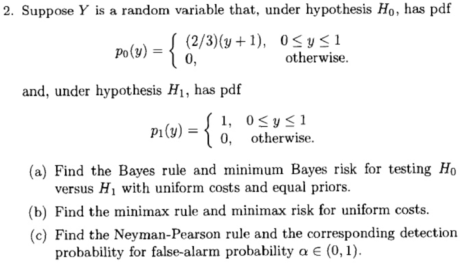
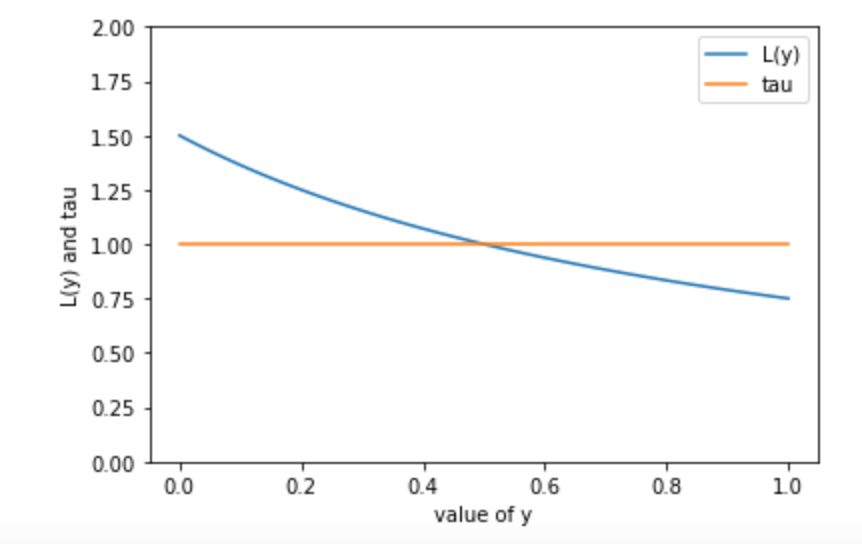
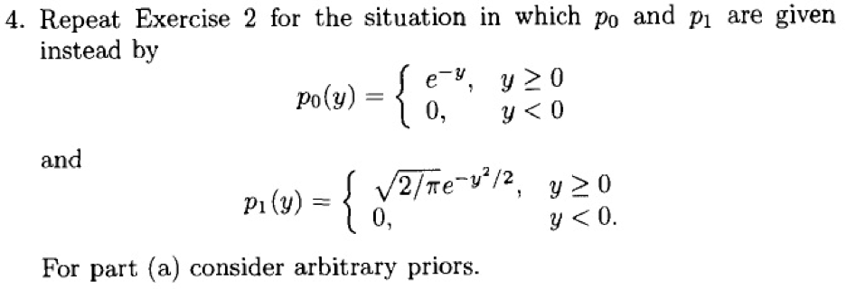
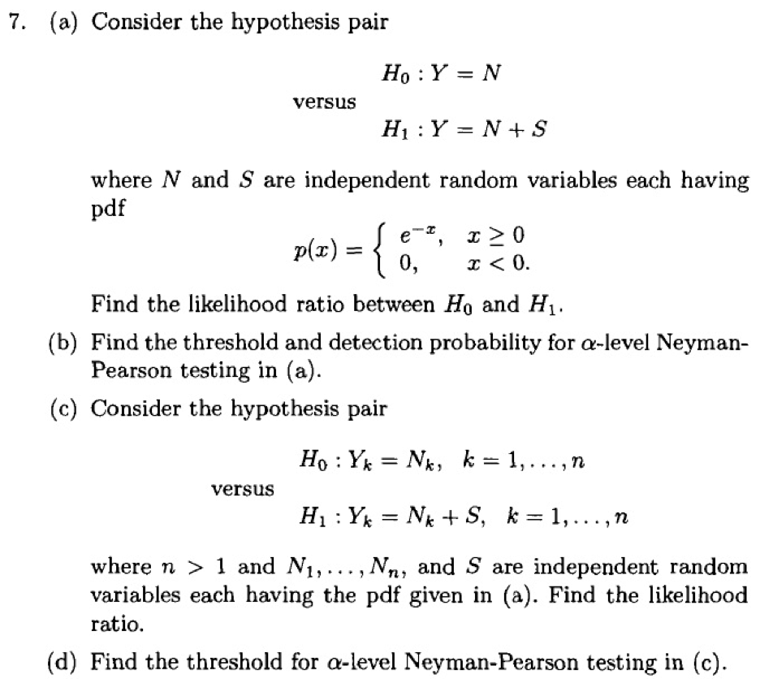
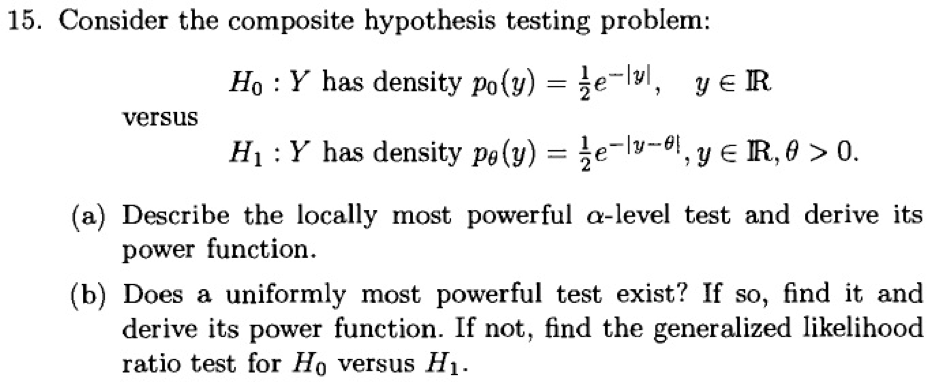
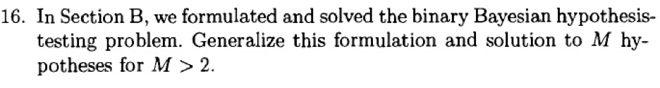
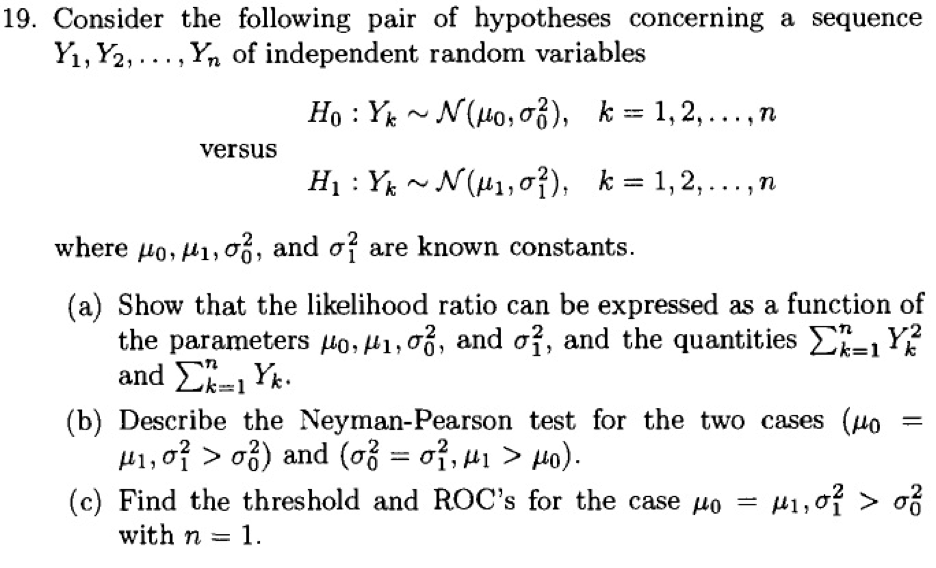

# An Introduction to signal Detection and Estimation
 BUPT homework

## HW-1

### 1st problem



#### solution (a):

Firstly, according to $(II.B.10)$​, write the likelihood ratio as:
$$
\begin{aligned}
L(y)&=\frac{p_1(y)}{p_0(y)}\\
&=\begin{cases}
\frac{3}{2(y+1)}, & 0\leq y \leq 1\\
meaninglesss, & \text{otherwise}
\end{cases}
\end{aligned}
$$


according to $(II.B.12)$​ The bayes rule can be writen as:
$$
\delta_{B}(y)= \begin{cases}1 & \text { if } L(y) \geq \tau \\ 0 & \text { if } L(y)<\tau\end{cases}
$$
where $\tau = 1$​ under the uniform costs and equal priors,

The plot of $L(y)$​ and $\tau$ is drawing as :



 Thus the bayes rule is rewritten to the form as:
$$
\begin{aligned}
\delta_{B}(y)&= \begin{cases}1, \text { if }\frac{3}{2(y+1)} \geq 1 \\ 0 & \text { if } \frac{3}{2(y+1)}<1\end{cases}\\
&=\begin{cases}1 & \text { if } y \leq 0.5 \\ 0 & \text { if } y>0.5\end{cases}
\end{aligned}
$$

The bayes risk is given by $(II.B.14)$​, and  because the uniform costs and equal priors, the Bayes risk can be written as:
$$
\begin{aligned}
r(\delta_B)&=\pi_{0} P_{0}\left(\Gamma_{1}\right)+\pi_{1} P_{1}\left(\Gamma_{0}\right)\\
&=0.5\int_{0}^{0.5}p_0(y)+0.5\int_{0.5}^{1}p_1(y)
\end{aligned}
$$
Where $p(y)= 0.5\cdot(p_1(y)+p_0(y))=\frac{2y+5}{6}$​​ , the risk is rewritten as:

$$
\begin{aligned}
r(\delta_B)
= 0.5\cdot \left[\int_0^{0.5}2/3\cdot (y+1)+\int_{0.5}^{1}1 \right]
\end{aligned}
$$
```matlab
fun1 = @(y) (2/3)./(y+1);
q1 = integral(fun1, 0, 0.5)

fun2 = @(y) y.^0
q2 = integral(fun2, 0.5, 1)

fanal = 0.5*(q1+q2)
```
var the matlab code shown above, the Bayes risk is calculated as:
$$
r(\delta_B) = 0.3852
$$

#### Solution(b):

The function $ V$ Is given by :
$$
V(\pi_0) = 
\begin{cases}
\pi_0, &0 \leq \pi_0 < 3/7
\\
\pi_0\left(\int_0^{\tau^{'}} \frac{2}{3}(y+1)\cdot dy\right)+(1-\pi_0)\left(\int_{\tau^{'}}^11\cdot dy \right), &3/7 \leq \pi_0 < 3/5\\
1-\pi_0, & 3/5 \leq \pi_0 < 1
\end{cases}
$$
Where $\tau^{'}= \frac{3-5\pi_0}{2\pi_0}$ Is the threotle. Since $V(0) = 0, V(1) = 0$​, the least favorable prior $\pi_L$

 is in the interior $(0, 1)$ in this case. And it is unnecessary to consider teh case that $P_{0}(L(Y)=\tau)=P_{1}(L(Y)=\tau)=0$ since $L(Y)$​ is a continuous random variable. So an equalizer rule is found by solving:
$$
\int_0^{\tau^{'}} \frac{2}{3}(y+1)\cdot dy=\int_{\tau^{'}}^11\cdot dy 
$$
Then, $\tau_L^{'}= \frac{-5+\sqrt{37}}{2}$​​​​​, so $\pi^{'}_L = \frac{3}{2\tau_0+5}=\frac{3}{\sqrt{37}}$​​​​, so the minimax rule is:
$$
\delta_{\pi_L}(y)&= \begin{cases}1, &\text { if }y  \leq \frac{3}{\sqrt{37}} \\ 0, & \text { if } y > \frac{3}{\sqrt{37}}\end{cases}
$$
Then the minimax risk for the uniform costs is:
$$
r_u(\delta_{\pi})=0.5\cdot \int_{0}^{\frac{3}{\sqrt{37}}}2/3\cdot (y+1)+0.5\cdot \int_{\frac{3}{\sqrt{37}}}^{1}1\cdot dy=0.4099
$$

```matlab
fun1 = @(y) 1/3.*(y+1);
q1 = integral(fun1, 0, 3/sqrt(37))

fun2 = @(y) 0.5*y.^0;
q2 = integral(fun2, 3/sqrt(37), 1)

fanal = q1+q1
```


#### Solution (c):

First, write the false-alarm probability as:
$$
\begin{aligned}
P_0(p_1(Y)>\eta \cdot p_0(Y))&=P_0(L(Y)>\eta)\\
&=P_0(Y<\eta^{'})\\
&=\frac{1}{3}{\eta^{'}}^{2}+\frac{2}{3}\eta^{'}
\end{aligned}
$$
Where $\eta^{'}=\frac{3-2\eta}{2\eta}$ and get the $\eta_0^{'}$ by sovling $P_0(p_1(Y)>\eta \cdot p_0(Y))=\alpha$:
$$
\eta_0^{'} = \sqrt{1+3\alpha}-1
$$
Then the Neyman-Pearson rule is given by:
$$
\tilde{\delta}_{N P}(y)= \begin{cases}1 & \text { if } y \geq \eta_{0}^{\prime} \\ 0 & \text { if } y<\eta_{0}^{\prime}\end{cases}
$$
Where $\eta_0^{'} = \sqrt{1+3\alpha}-1$​.


### 2rd problem




### 3rd problem





### 4th problem




### 5th problem




### 6th problem



